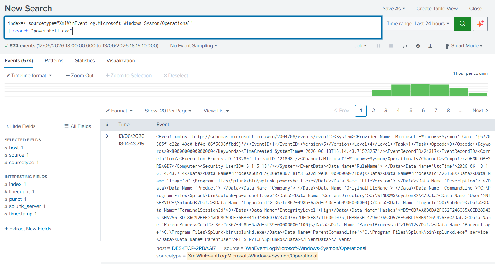
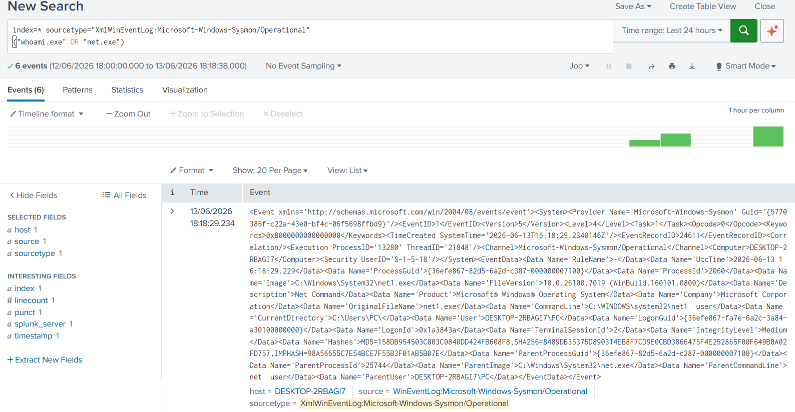

# Splunk Attack Simulation Lab

## Overview

This project demonstrates adversary attack simulations and detection engineering using Splunk Enterprise and Sysmon telemetry.

The objective is to execute common attacker techniques and validate detection coverage using Splunk SPL searches.

---

## Environment

| Component  | Details                                             |
| ---------- | --------------------------------------------------- |
| SIEM       | Splunk Enterprise 10.4                              |
| Endpoint   | Windows 11                                          |
| Telemetry  | Sysmon                                              |
| Log Source | Microsoft-Windows-Sysmon/Operational                |
| Sourcetype | XmlWinEventLog:Microsoft-Windows-Sysmon/Operational |

---

## Simulated Techniques

| MITRE ATT&CK | Technique         |
| ------------ | ----------------- |
| T1059.001    | PowerShell        |
| T1087        | Account Discovery |

---

## T1059.001 - PowerShell Execution

### Attack Simulation

```powershell
Get-Process
Get-Service
```

### Detection Query

```spl
index=* sourcetype="XmlWinEventLog:Microsoft-Windows-Sysmon/Operational"
| search "powershell.exe"
```

### MITRE ATT&CK

T1059.001 - PowerShell

### Detection Result

PowerShell execution events were successfully detected through Sysmon process creation logs.



---

## T1087 - Account Discovery

### Attack Simulation

```cmd
whoami
net user
```

### Detection Query

```spl
index=* sourcetype="XmlWinEventLog:Microsoft-Windows-Sysmon/Operational"
("whoami.exe" OR "net.exe")
```

### MITRE ATT&CK

T1087 - Account Discovery

### Detection Result

Account enumeration activity was detected using Sysmon process creation telemetry.



---

## Skills Demonstrated

* Splunk Enterprise
* Sysmon Deployment
* Detection Engineering
* Threat Hunting
* MITRE ATT&CK Mapping
* SPL Query Development
* Windows Security Monitoring
* Attack Simulation

---

## Future Improvements

* Add Network Discovery detections (T1016)
* Add Command Shell detections (T1059.003)
* Create Splunk correlation searches
* Build ATT&CK coverage matrix
* Develop custom dashboards
* Simulate additional attack techniques

```
```
